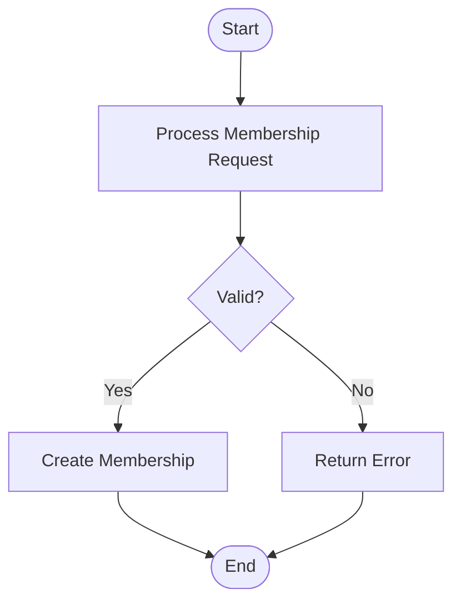

# Documentation Style Guide

## Overview

This guide defines the writing style, voice, terminology standards, and visual design principles for all Nonprofit Membership Tracking project documentation. It complements the [Document Structure Standards](NMT-Document_Structure_Standards.md) by focusing on content creation rather than structure. Following these standards ensures a consistent voice and presentation across all project documentation.

## Writing Style Standards

### Tone and Voice

All project documentation should maintain:

1. **Professional but Accessible Tone**
   - Avoid overly technical jargon when simple language will suffice
   - Define technical terms when they must be used
   - Write for an audience with basic Salesforce knowledge

2. **Clear and Direct Voice**
   - Use active voice rather than passive voice
   - Present information directly and concisely
   - Avoid unnecessary qualifiers and hedging language

3. **Consistent Person and Tense**
   - Use second person ("you") when providing instructions
   - Use present tense for current state descriptions
   - Use future tense only when describing outcomes or future states

### Examples

| ❌ Avoid | ✅ Use Instead | Reason |
|---------|--------------|--------|
| "The system will be attempting to process the renewal." | "The system processes the renewal." | Uses active voice and present tense |
| "It might be a good idea to configure validation rules." | "Configure validation rules to prevent invalid data." | More direct and actionable |
| "Users would typically navigate to the dashboard." | "Navigate to the dashboard." | Simpler, clearer instruction |

### Paragraph Structure

- Keep paragraphs concise (3-5 sentences maximum)
- Begin paragraphs with a clear topic sentence
- Use one paragraph per distinct idea or concept
- Use transition words to connect ideas between paragraphs

## Terminology and Language

### Consistent Terms

| Term | Definition | Usage Context |
|------|------------|---------------|
| Member | An individual or organization with an active membership | Use consistently instead of "user," "customer," or "client" |
| Membership Level | The specific tier of membership (e.g., Basic, Premium) | Use consistently instead of "tier," "plan," or "package" |
| Renewal | The process of extending an existing membership | Use consistently instead of "extension" or "continuation" |
| Dashboard | A visual display of key metrics and reports | Use consistently instead of "report page" or "analytics view" |

### Abbreviations and Acronyms

- Define all abbreviations and acronyms at first use
- Follow the pattern: Full Term (ACRONYM)
- Example: "Nonprofit Success Pack (NPSP)"
- Create a glossary section for documents with many specialized terms

### Capitalization

- Use title case for all document titles, section headings, and product names
  - Example: "Membership Renewal Flow Design"
- Use sentence case for field names, button labels, and UI elements when not directly referencing their exact appearance
  - Example: "Click the Create member button"
- Use all caps only for acronyms and specific UI elements that appear in all caps

## Formatting Rules

### Text Emphasis

| Emphasis Type | Markdown Format | Usage |
|---------------|----------------|-------|
| **Bold** | `**text**` | Use for UI elements, important warnings, key concepts at first mention |
| *Italic* | `*text*` | Use for new terminology, slight emphasis, publication titles |
| `Monospace` | `` `text` `` | Use for code, field API names, formulas, file names |
| ~~Strikethrough~~ | `~~text~~` | Use sparingly only for deprecated features |

### Callouts and Notes

Use consistent formatting for notes, warnings, and tips:

```markdown
> **Note:** Use for additional helpful information that is not critical.
{: .note }

> **Warning:** Use for critical information that prevents errors or data loss.
{: .warning }

> **Best Practice:** Use for recommended approaches and implementations.
{: .best-practice }
```

### Lists and Steps

- Use numbered lists for sequential steps or prioritized items
- Use bullet points for unordered lists
- Be consistent with punctuation in lists:
  - End each list item with a period if it's a complete sentence
  - No period for incomplete sentences or single words/phrases
  - Be consistent within each list
- Maintain parallel structure within lists (start each item with same part of speech)

## Visual Design Recommendations

### Screenshots and Images

- Include screenshots for complex UI interactions
- Size images appropriately (recommended width: 600-800 pixels)
- Use consistent border and annotation styles
- Include descriptive alt text for all images
- Use file naming convention: `NMT-[Component]-[Description].png`

### Diagram Standards

#### Flow Diagrams

- Use Mermaid syntax for flow diagrams
- Begin flows at the top and flow downward or left-to-right
- Use consistent shapes:
  - Rectangles for processes/actions
  - Diamonds for decision points
  - Ovals for start/end points
- Use consistent colors:
  - Blue for standard processes
  - Green for successful endpoints
  - Yellow for user interactions
  - Red for error conditions or exceptions

Example Mermaid diagram:



#### Entity Relationship Diagrams

- Use consistent notation for relationships:
  - (1) for "one" side of relationship
  - (n) for "many" side of relationship
  - ◄─────► for connecting lines
- Position primary objects at the top or left
- Show only relevant fields in diagrams

### Color Usage

- Use a consistent color palette across all documentation
- Ensure sufficient contrast for readability
- Use color as enhancement, not as the only means of conveying information
- Recommended color palette:
  - Primary: #0070D2 (Salesforce Blue)
  - Secondary: #00A1E0 (Light Blue)
  - Accent: #FFB75D (Orange)
  - Success: #4BCA81 (Green)
  - Warning: #FFB75D (Orange)
  - Error: #FF5D5D (Red)
  - Neutral: #706E6B (Gray)

## Naming Conventions

### File Naming

- All documentation files should use the prefix `NMT-`
- Use underscores to separate words
- Include the document type in the filename
- Use clear, descriptive names
- Follow the pattern: `NMT-[Component]_[DocumentType].md`

Examples:
- `NMT-Membership_Renewal_Flow_Design.md`
- `NMT-Data_Model_Design_Consolidated.md`
- `NMT-Financial_Reports_Specs.md`

### Cross-Reference Linking

- Use relative links for all internal references
- Include meaningful link text (not "click here")
- Pattern: `[Descriptive Link Text](relative/path/to/document.md)`

Examples:
- `[Membership Renewal Flow](../Flows/NMT-Membership_Renewal_Flow_Design.md)`
- `[Data Model](NMT-Data_Model_Design_Consolidated.md)`

### Section References and Anchors

- When linking to specific sections, use anchor links
- Pattern: `[Document Title - Section Name](path/to/document.md#section-id)`
- Section IDs are lowercase with hyphens replacing spaces

Example:
- `[Data Model - Validation Rules](NMT-Data_Model_Design.md#validation-rules)`

## Version and Change Tracking

### Version Numbering

- Follow semantic versioning: MAJOR.MINOR.PATCH
- MAJOR: Significant structural changes (1.0 → 2.0)
- MINOR: Content updates that don't change structure (1.0 → 1.1)
- PATCH: Minor corrections or clarifications (1.1 → 1.1.1)

### Document History

- Maintain frontmatter `updated` field for all changes
- For substantial changes, include a Document History section:

```markdown
## Document History

| Version | Date | Author | Changes |
|---------|------|--------|---------|
| 1.0 | 2025-04-01 | Documentation Team | Initial version |
| 1.1 | 2025-04-15 | Documentation Team | Added security section |
```

## Writing for Different Document Types

### Technical Documentation

- Begin with clear purpose and scope
- Define all technical terms
- Include implementation considerations
- Reference related systems and dependencies
- Provide troubleshooting guidance for common issues

### Process/Flow Documentation

- Clear description of trigger/starting point
- Detailed explanation of each decision point
- Error handling for each potential failure
- End-to-end examples of process execution
- Reference related processes and handoffs

### User-Facing Documentation

- Task-oriented structure (organized by what users want to accomplish)
- Step-by-step instructions with screenshots
- Examples of completed tasks
- Troubleshooting section for common issues
- References to related tasks

## Common Terminology Mistakes

| Incorrect | Correct | Note |
|-----------|---------|------|
| Salesforce admin | Salesforce Administrator | Use full title |
| APEX | Apex | Only "A" is capitalized |
| salesforce | Salesforce | Always capitalize product names |
| plugin | plug-in | Use hyphen |
| setup | set up | "Setup" (noun) vs. "set up" (verb) |
| signin | sign in | Use space for verb form |

## Document Quality Checklist

Before finalizing any document, verify:

- [ ] Frontmatter is complete and accurate
- [ ] Document follows the style and structure standards
- [ ] All links work and reference the correct documents
- [ ] All diagrams follow visual design standards
- [ ] All terminology is consistent with the style guide
- [ ] Spelling and grammar have been checked
- [ ] No passive voice or unnecessarily complex language
- [ ] All acronyms are defined at first use
- [ ] Content is complete according to template for document type

## Related Documents

- [Document Structure Standards](NMT-Document_Structure_Standards.md)
- [Templates Directory](0.%20MAIN/0.4CAREER%20HUNTER/002.%20sprint2/PROJECTS/NONPROFIT_TRACKER/Docs/Templates/README.md)
- [Data Model Template](NMT-Data_Model_Template.md)
- [Flow Design Template](NMT-Flow_Design_Template.md)
- [Test Case Template](NMT-Test_Cases_Template.md)
- [Report/Dashboard Template](NMT-Report_Dashboard_Template.md) 